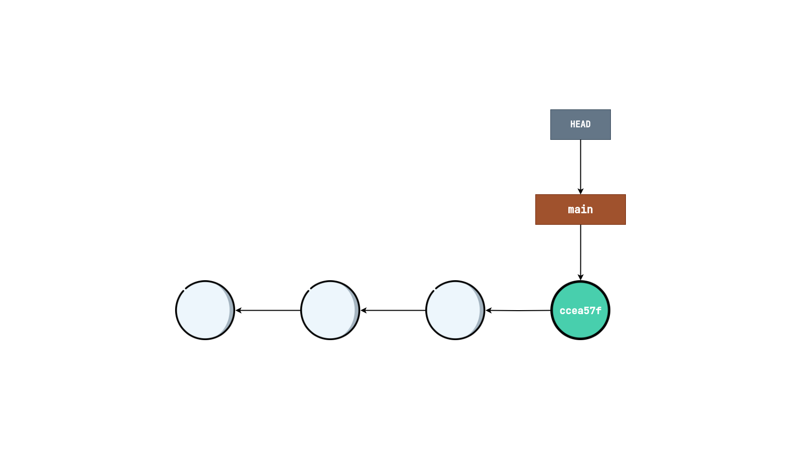
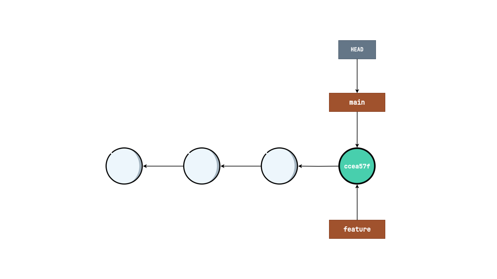
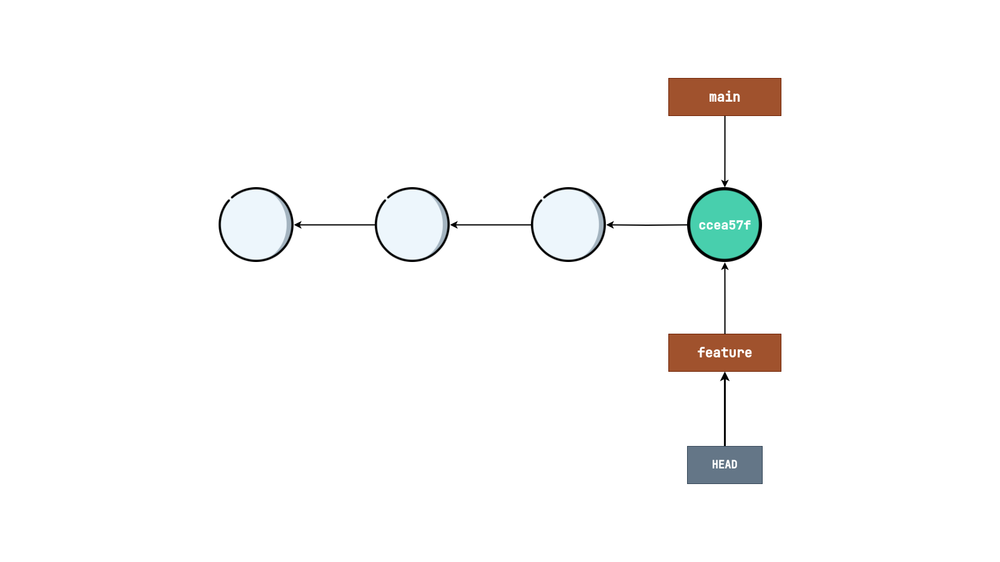

## Branch
A lightweight movable pointer to a commit

### Commands
*အသုံးပြုမည့် commands များ*
- `git branch`
- `git checkout`
- `git tag`
---

### Inspect
- Linear ဖြစ်နေတဲ့ commit history တွေကိုမြင်သာအောင်ကြည့်မယ်ဆိုရင် အောက်ပါအတိုင်း မြင်တွေ့ရမှာ ဖြစ်ပါတယ်။

  

- Branch နှင့်အတူ ကြည့်မယ်ဆိုရင်တော့ အောက်ပါအတိုင်းမြင်တွေ့ရမှာ ဖြစ်ပါတယ်။

  
----

### New branch (Branch အသစ်ဖန်တီးခြင်း)

#### Creating and checking out with seperate command

မတူညီသော command 2 ခုကိုအသုံးပြုပြီး branch အသစ်တည်ဆောက်ပြီး နှင့် switch လုပ်ခြင်း

- Branch အသစ်တည်ဆောက်ခြင်း
  
  - *`git branch` command ကိုသုံးပြီးတော့ branch တွေကိုဖန်တီးလို့ရပါတယ်*

  - အသုံးပြုပုံ
    ```
    git branch feature
    ```

  - Visualize
  
    
  
- Branch တွေကို switch လုပ်ခြင်း
      
    - အသုံးပြုပုံ
      ```console
      git checkout feature
      ```

    - Visualize

      
---

#### Creating and checking out
*`git checkout` command တစ်ခုတည်းကို အသုံးပြုပြီး branch ကို switch လုပ်သည့်အချိန်တွင် တစ်ခါတည်း branch ကိုဖန်တီး လို့ရနိုင်ပါတယ်*
  
- အသုံးပြုပုံ
  ```console
  git checkout -b feature
  ```
---

### List
- Local မှာရှိနေတဲ့ branch တွေကို list လုပ်ပြီးကြည့်ချင်ရင်

  ```
  git branch
  ```

- Remote branch တွေကိုပါ ပြစေချင်ရင်
  ```
  git branch -r
  ```
- အကုန်လုံးကို ကြည့်ချင်ရင် 
  ```
  git branch -a
  ```
---

### Rename
- Branch တွေကို rename လုပ်ချင်ရင်တော့အောက်ပါအတိုင်း လုပ်ဆောင်နိုင်မှာ ဖြစ်ပါတယ်။
- လုပ်ဆောင်ပုံ
  ```
  git branch -m new-feature
  ```
---

### Delete
- *Local branch တွေကို မလိုအပ်တော့ရင် ဖျက်ပစ်လို့ ရနိုင်ပါတယ်*
- အသုံးပြုပုံ
  ```
  git branch -d new-feature
  ```
---

