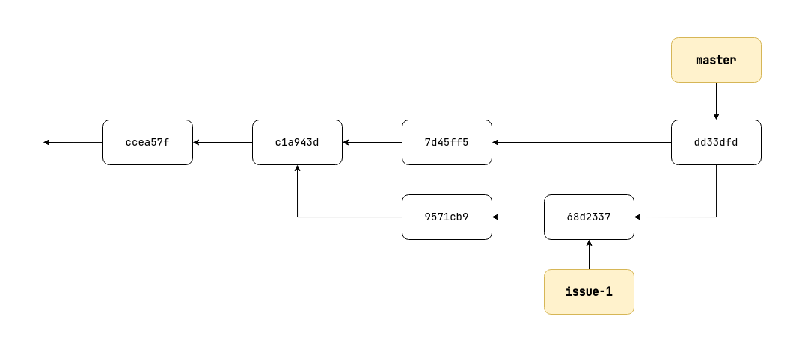

## Merge
History, changes တွေကိုပြန်လည်ပေါင်းစည်းတာဖြစ်ပါတယ်။

### Commands
*Merge လုပ်ဖို့အောက်ဖော်ပြပါ command ကိုအသုံးပြုရမှာဖြစ်ပါတယ်*
- `git merge`

### Two main ways
- Fast Forward
- 3-way

### 1. Fast Forward
*Linear ဖြစ်နေရင်တော့ Fast forward ပုံစံ merge သွားမှာပါ*

- Before merge

  

- Merge
  *Merge လုပ်စေချင်တဲ့ branch ကို checkout လုပ်ထားရပါမယ်*
  - Command Usage
    ```
    git merge feature-1
    ```
  - ရလဒ်
    ```
    Updating ccea57f..c1a943d
    Fast-forward
     README.md | 2 +-
     1 file changed, 1 insertion(+), 1 deletion(-)
    ```
- After merge  
  *Git က pointer ကိုပဲရွှေ့သွားတာကို တွေမြင်ရမှာဖြစ်ပါတယ်*  
  

### 2. 3-ways
*အဆင့်ဆင့် နားလည်အောင် ကြည့်လိုက်ရအောင်*

- Initial  
  *Branch ၂ ခုက main ဆီက ခွဲထွက်ပြီးတော့ သီးခြားဆီအလုပ်လုပ်နေပါတယ်။*  
  
  
- Merge feature branch  
  
  - Feature branch ကို merge လိုက်ပါမယ်  
    ```
    git merge feature-1
    ```
  - အောက်ပါအတိုင်း ဖြစ်သွားမှာဖြစ်ပါတယ်  
    

- Merge
  *အောက်ပါပုံမှာ 3-way ကိုမြင်သာအောင်ဖော်ပြထားပါတယ်*  
  

- Merge issue branch
  - Issue branch ကို merge လိုက်ပါမယ်
    ```
    git merge issue-1

    Merge made by the 'ort' strategy.
     issue.txt | 1 +
     1 file changed, 1 insertion(+)
     create mode 100644 issue.txt
    ```
  - မြင်သာအောင်ကြည့်ရအောင်  
    

> **Git ရဲ့ အခြေခံ merge လုပ်ခြင်းကိုနားလည်သလို ပြန်လည်ရေးသားထားခြင်းဖြစ်ပါတယ်။**